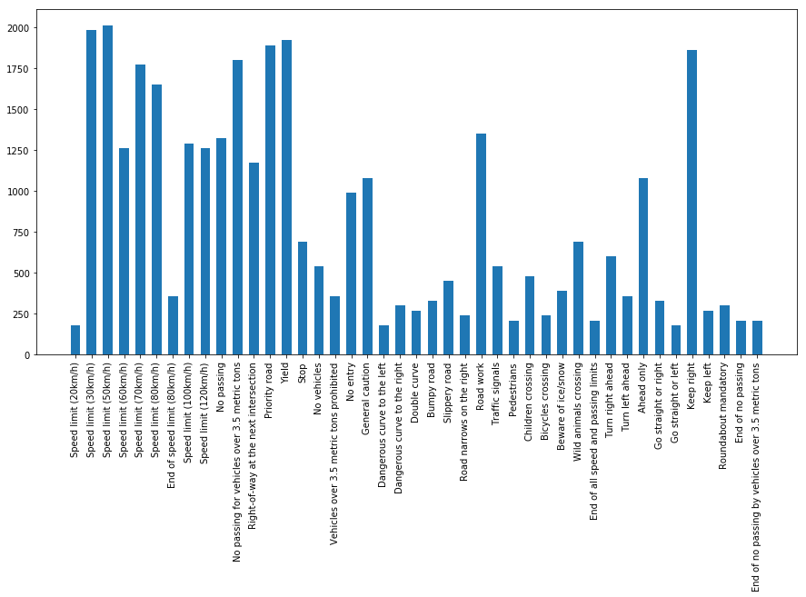
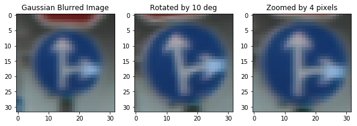
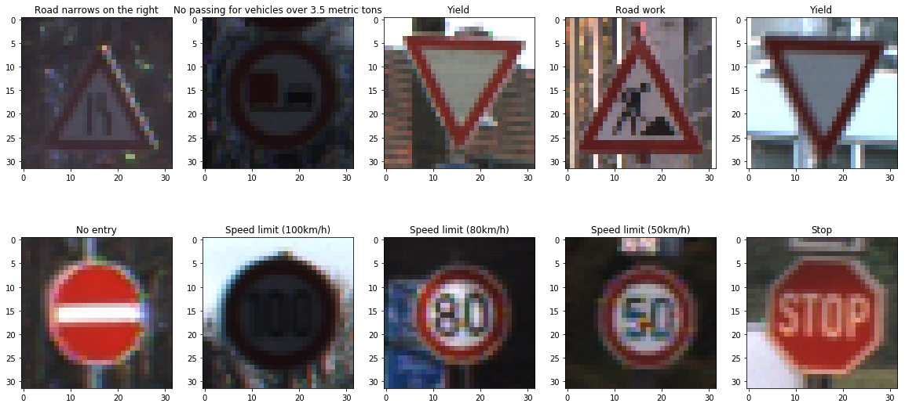
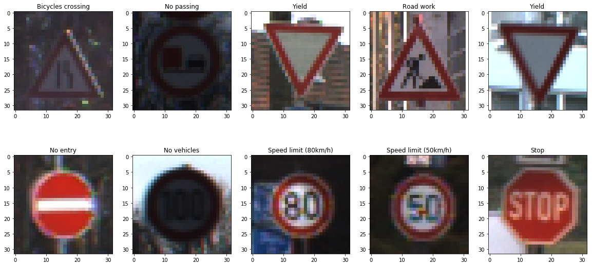
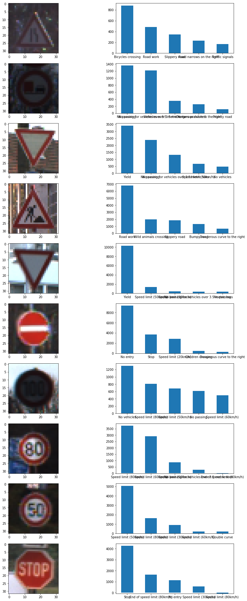

# Traffic Sign Recognition

Project on using convolutional neural networks to predict the traffic signs. Network is trained using German traffic sign dataset and tested on other data available online to measure the performance.

### Data Set Summary & Exploration

Datset has 34799 training examples, 12630 testing examples which belong to 43 classes and are (32,32) images with 3 color channels. Image below shows the distribution of classes in the training dataset:

As we can see, some classes like 'dangerous curve' have much fewer samples compared to speed limit classes. It is preferred to have a balanced dataset for training. 

### Preprocessing

Several methods are used to preprocess the images. Initially, images are normalized using `StandardScaler` module from `sklearn`. This is trained with X_train and fit to all other data. Data normalization makes the problem well conditioned by making features centered around mean and have unit variance.  This process helped improve accuracy on training as well as validation data.

Additionally, as a way of data augmentation, I also applied following methods on the train images:

- Image rotation (randomly rotated images by (-10,10) degress)
- Added gaussian blur
- Zoomed the images

With these techniques, I ended up with 104397 additional training samples, making the total training set of 139196 images. These helped me achieve about ~0.9-1.2% accuracy on the validation set with same model.

Original Image: 

Augmentation Example:

### Model Architecture & Training

I used the LeNet architecture discussed in lecture. This has a 2 convolutional layers with max_pool layers and 3 fully connected layers at the end. I used softmax cross entropy loss with Adam optimizer for the project. As a major part of the project, I did try different parameters for learning rate, batch size and learning rates. Below table represents my observations on validation dataset:

| Epochs | Batch Size | Learning Rate | Accuracy |
| --- | --- | --- | --- |
| 10 | 128 | 0.001 |  0.878 |
| 100 | 256 | 0.001 |  0.921 |
| 10 | 128 | 0.001 |  0.877 |
| 10 | 128 |  0.0001 | 0.885 | 
| 100 | 128 | 0.001 | 0.919 |
| __25__ | __128__ | __0.001__ | __0.925__ |

Last column represents the one used for final submission and performed with augmented data. Maximum accuracy seen on validation set is __0.939__ for one of the epochs.

### Test Data

I downloaded data from  http://benchmark.ini.rub.de/Dataset/GTSRB_Final_Test_Images.zip and following picture shows the images I used for testing. Interestingly, they were in various sizes, so I had to resize them before using for testing. Some of the images are really dark and are a good test for the network prediction accuracy. 

I achieved a __70%__ prediction accuracy on these images. But, on the original test set, I achieved __91.9%__ accuracy. This clearly indicates that, my model does behave well on the data it was trained with and not so well well on the completely different data. This problem can be addressed with following ways:

- Train the model with more images (This would need collecting more data)
- Preprcess the images to create more data samples for training. Along with methods I performed above, I could adjust the brightness, and translate the images to include image shifts.
- Search with a window based technique. This is because, the test data set doesn't cover the whole image width/height, as it was in the training set. So a sliding window technique would improeve the test accuracy.

Image with actual labels:

Images with predicted labels:

Image with top-5 prediction for each image:

